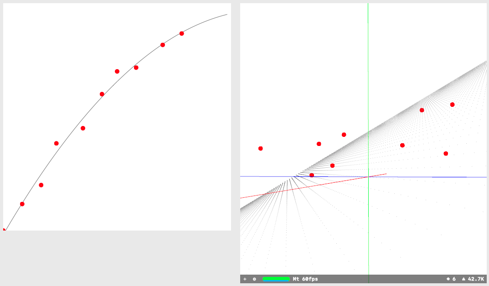

# ApproximateCurveAndPlane
This is a minimum sample code to calculate approximate curve and plane using 
Least squares method and Gauss-Jordan elimination in macOS.

macOS 10.15.3 Catalina  
Xcode 11.3.1  
Swift 5.1.3
